# ChaLog 서버 아키텍처

> **💡 Mermaid 다이어그램 보기**: 이 문서는 Mermaid 다이어그램을 사용합니다.
> 
> **VS Code에서 보는 방법:**
> 1. 확장 프로그램 설치: `Cmd+Shift+X` → "Markdown Preview Mermaid Support" 검색 → 설치
> 2. 또는 "Mermaid Preview" 확장 프로그램 설치
> 3. 마크다운 파일을 열고 `Cmd+Shift+V` (Mac) 또는 `Ctrl+Shift+V` (Windows/Linux)로 미리보기 열기
> 4. 프로젝트의 `.vscode/settings.json`에 Mermaid 테마 및 스타일 설정이 포함되어 있습니다
>    - 기본 테마: `dark` 테마 (다크 모드)
>    - 폰트 크기: 14px, 줄 간격: 1.6
> 
> **온라인에서 보는 방법:**
> - [Mermaid Live Editor](https://mermaid.live/)에서 코드를 복사하여 확인
> - GitHub에서 파일을 열면 자동으로 렌더링됨

## 전체 시스템 구조

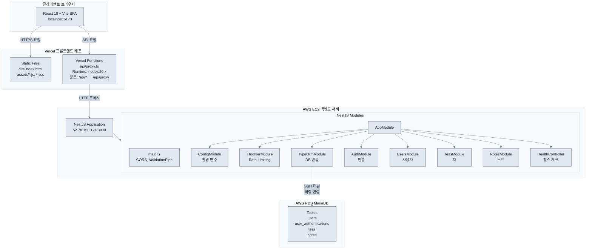

## 상세 모듈 구조

### 1. 프론트엔드 (Vite + React)

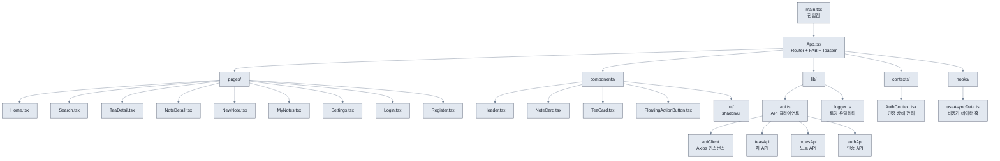

### 2. Vercel 프록시 (api/proxy.ts)

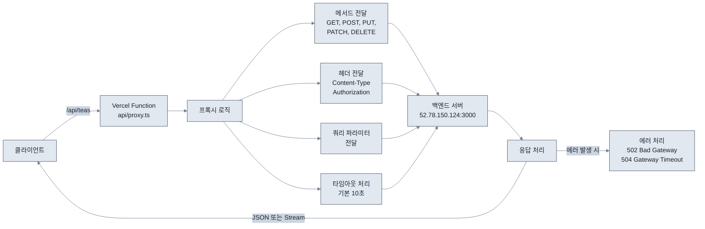

**요청 흐름:**
```
클라이언트 → /api/teas → Vercel Function → http://52.78.150.124:3000/teas
```

### 3. 백엔드 (NestJS)

```mermaid
%%{init: {'theme':'base', 'themeVariables': { 'primaryColor':'#e2e8f0', 'primaryTextColor':'#1a202c', 'primaryBorderColor':'#4a5568', 'lineColor':'#718096', 'secondaryColor':'#cbd5e0', 'tertiaryColor':'#f7fafc'}}}%%
graph TD
    Main["main.ts<br/>애플리케이션 부트스트랩<br/>CORS 설정<br/>ValidationPipe 설정<br/>서버 시작 포트 3000"] --> AppModule["app.module.ts<br/>루트 모듈"]
    
    AppModule --> ConfigModule["ConfigModule<br/>환경 변수 관리"]
    AppModule --> ThrottlerModule["ThrottlerModule<br/>Rate Limiting<br/>1분당 10회"]
    AppModule --> TypeOrmModule["TypeOrmModule<br/>데이터베이스 연결"]
    AppModule --> AuthModule["AuthModule<br/>인증 모듈"]
    AppModule --> UsersModule["UsersModule<br/>사용자 모듈"]
    AppModule --> TeasModule["TeasModule<br/>차 모듈"]
    AppModule --> NotesModule["NotesModule<br/>노트 모듈"]
    AppModule --> HealthController["HealthController<br/>헬스 체크"]
    
    AuthModule --> AuthController["auth.controller.ts<br/>POST /auth/register<br/>POST /auth/login<br/>POST /auth/kakao<br/>POST /auth/profile"]
    AuthModule --> AuthService["auth.service.ts<br/>인증 로직"]
    AuthModule --> Strategies["strategies/"]
    Strategies --> JWTStrategy["jwt.strategy.ts<br/>JWT 전략"]
    Strategies --> LocalStrategy["local.strategy.ts<br/>로컬 전략"]
    AuthModule --> AuthDTO["dto/<br/>register.dto.ts<br/>login.dto.ts<br/>kakao-login.dto.ts"]
    
    UsersModule --> UsersController["users.controller.ts<br/>GET /users/:id"]
    UsersModule --> UsersService["users.service.ts<br/>사용자 비즈니스 로직"]
    UsersModule --> UserEntities["entities/<br/>user.entity.ts<br/>user-authentication.entity.ts"]
    
    TeasModule --> TeasController["teas.controller.ts<br/>GET /teas<br/>GET /teas/:id<br/>POST /teas"]
    TeasModule --> TeasService["teas.service.ts<br/>차 비즈니스 로직"]
    TeasModule --> TeaEntity["entities/<br/>tea.entity.ts"]
    TeasModule --> TeaDTO["dto/<br/>create-tea.dto.ts"]
    
    NotesModule --> NotesController["notes.controller.ts<br/>GET /notes<br/>GET /notes/:id<br/>POST /notes<br/>PATCH /notes/:id<br/>DELETE /notes/:id"]
    NotesModule --> NotesService["notes.service.ts<br/>노트 비즈니스 로직"]
    NotesModule --> NoteEntity["entities/<br/>note.entity.ts"]
    NotesModule --> NoteDTO["dto/<br/>create-note.dto.ts<br/>update-note.dto.ts"]
    
    TypeOrmModule --> TypeOrmConfig["database/<br/>typeorm.config.ts<br/>MariaDB 연결 설정<br/>SSL 설정 AWS RDS<br/>연결 풀 설정"]

```

## API 엔드포인트 구조

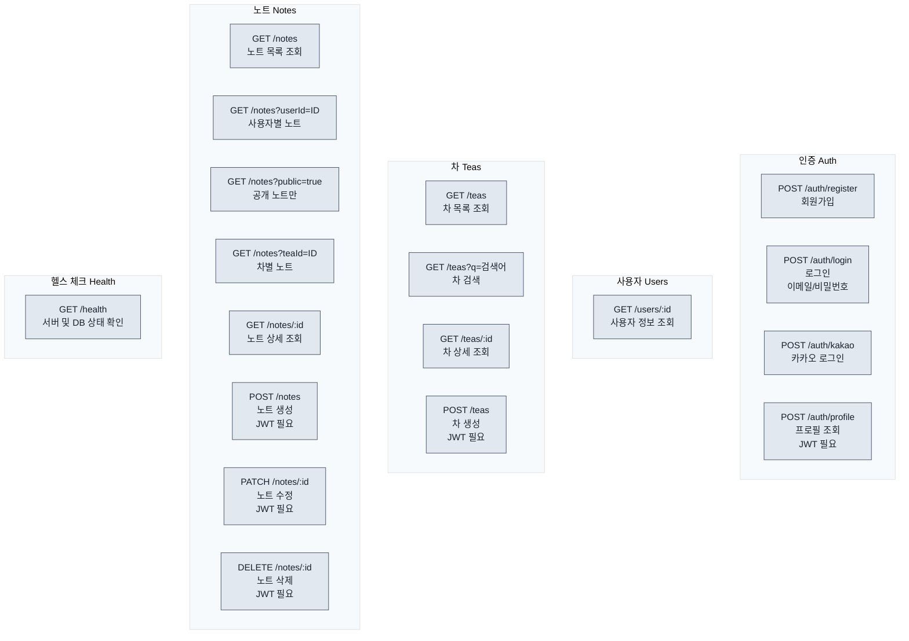

## 데이터 흐름

### 1. 인증 플로우

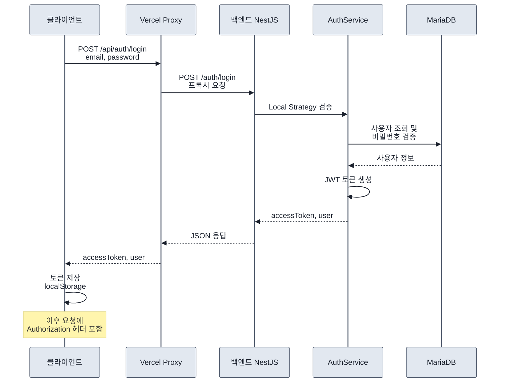

### 2. 데이터 조회 플로우

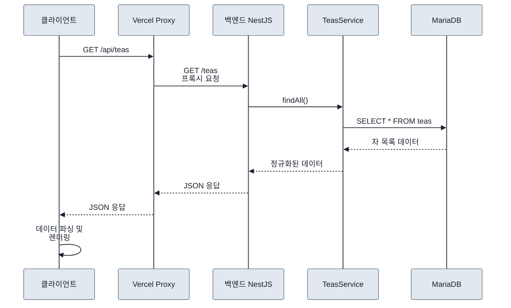

### 3. 데이터 생성 플로우

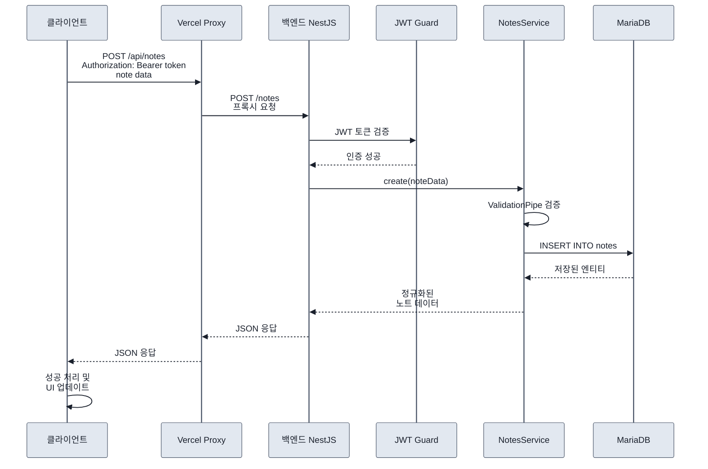

## 보안 계층

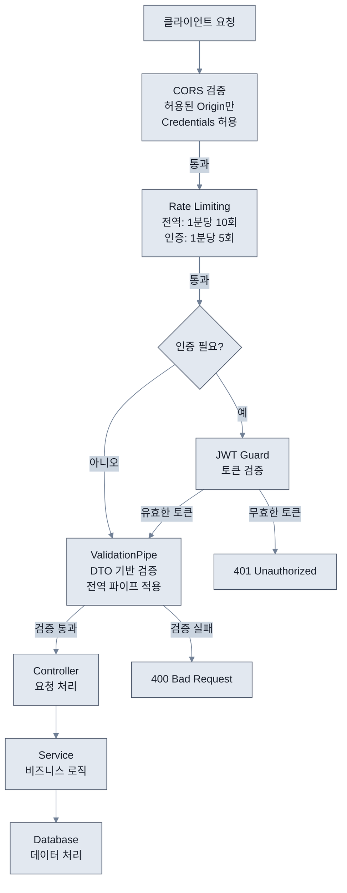

### 보안 계층 상세

#### 1. Rate Limiting
- **전역**: 1분당 10회 요청 제한
- **인증 엔드포인트**: 1분당 5회 요청 제한

#### 2. 인증
- **JWT**: Access Token 기반 인증
- **전략**: Local Strategy (이메일/비밀번호), Kakao OAuth

#### 3. CORS
- 허용된 Origin만 요청 허용
- Credentials 허용 (쿠키/인증 헤더)

#### 4. Validation
- DTO 기반 입력 검증
- 전역 ValidationPipe 사용

## 배포 구조

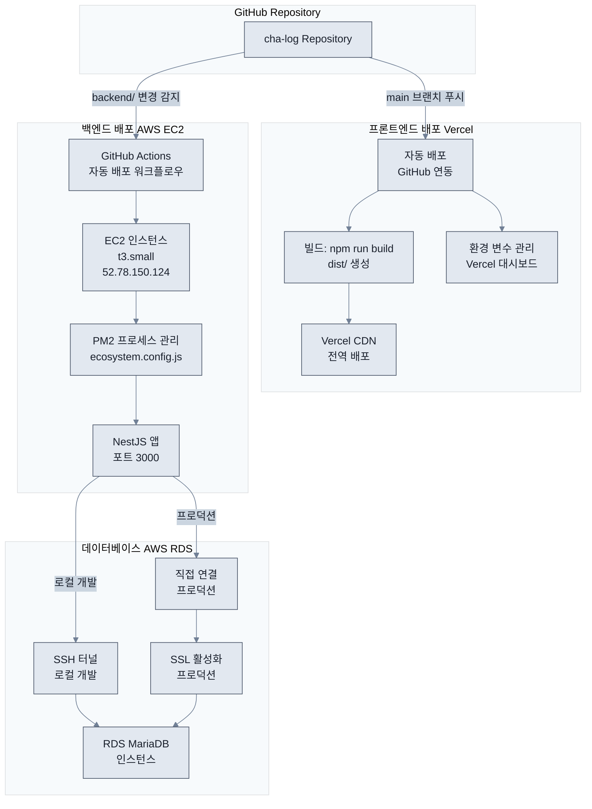

## 환경 변수

### 프론트엔드
- `VITE_API_BASE_URL`: 백엔드 API URL (기본값: `/api`)

### Vercel Functions
- `BACKEND_URL`: 백엔드 서버 URL (기본값: `http://52.78.150.124:3000`)
- `BACKEND_TIMEOUT_MS`: 타임아웃 시간 (기본값: `10000`)
- `LOG_PROXY_REQUESTS`: 프록시 요청 로깅 여부 (기본값: `true`)

### 백엔드
- `PORT`: 서버 포트 (기본값: `3000`)
- `DATABASE_URL`: 데이터베이스 연결 URL
- `JWT_SECRET`: JWT 시크릿 키
- `FRONTEND_URL`: 프론트엔드 URL (CORS 설정)
- `FRONTEND_URLS`: 여러 프론트엔드 URL (쉼표 구분)
- `NODE_ENV`: 환경 (development/production)
- `DB_SSL_ENABLED`: SSL 활성화 여부
- `DB_SYNCHRONIZE`: TypeORM 동기화 여부 (개발 환경만)

## 네트워크 흐름

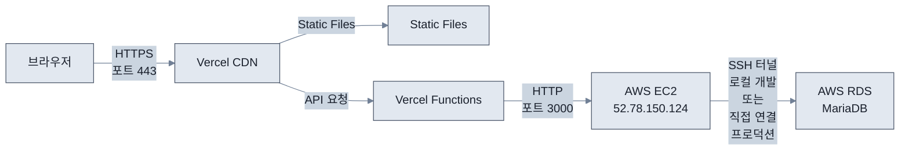

## 모니터링 및 로깅

### 프론트엔드
- 개발 환경: `logger.ts`를 통한 콘솔 로깅
- 프로덕션: Vercel 로그

### 백엔드
- 개발 환경: NestJS 기본 로깅
- 프로덕션: PM2 로그, EC2 시스템 로그

### 프록시
- Vercel Functions 로그
- 요청/응답 로깅 (LOG_PROXY_REQUESTS 환경 변수로 제어)

